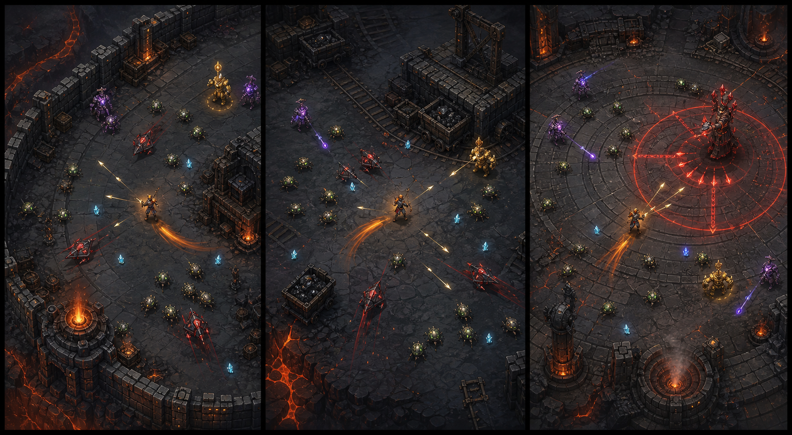

# Kampf – Designrichtungen v1



Die drei Entwürfe sind als zusammengehörige Räume des ausgewählten
Kraterholds gedacht. Sie zeigen eine mögliche Zielqualität für Umgebung,
Gegnerlesbarkeit und Effekte – noch keine fertigen Spiel-Assets.

## A – Verteidigung am Außenring (links)

Offener Basaltplatz zwischen Mauersegmenten, Glutkanälen und wenigen
Barrikaden.

- beste Standardarena für den ersten spielbaren Run
- offene Bewegungsflächen unterstützen Aelrics Kiten
- Mauern und Öfen schaffen Orientierung ohne Gameplay zu blockieren
- wenige modulare Stein-, Eisen- und Glutbauteile reichen für viele Varianten

## B – Förderhof (Mitte)

Mine, Schienen, Förderanlagen und gestapelte Plattformen bilden deutliche
Landmarken.

- stärkste Verbindung zwischen Kampf und Hold-Produktion
- visuell abwechslungsreicher als eine leere Fläche
- Deckung und enge Wege dürfen nicht zu echter Kollisionskomplexität führen
- eignet sich später für Ressourcen- oder Elite-Ereignisse

## C – Warden-Arena (rechts)

Konzentrische Bodenringe und Ember-Vents machen Bossmuster sichtbar.

- beste Bühne für Mittelboss und Warden
- rote Telegrafien sind auf dem entsättigten Boden sehr klar
- sollte als besonderer Höhepunkt reserviert bleiben
- für normale acht Minuten allein zu statisch und kreisförmig

## Gewählte Umsetzung: C – Warden-Arena

Der rechte Entwurf ist die verbindliche visuelle Richtung für den
Phase-0-Kampf. Seine Sprache wird kostengünstig auf den gesamten Run übertragen:

1. Dunkle Basaltplatten ersetzen den abstrakten Gitterboden.
2. Große konzentrische Warden-Kreise gliedern die offene Welt, ohne Kollision
   oder zusätzliche Leveldaten zu benötigen.
3. Ember-Vents und Warden-Pfeiler markieren die äußeren Ringe als reine Kulisse.
4. Der Boss erhält die volle rote Runen- und Pfeiltelegrafie; normale Gegner
   bleiben zurückhaltender, damit der Höhepunkt besonders wirkt.

Die Umgebung entsteht im Browser prozedural aus vorgerenderten kleinen
Canvas-Sprites. Es werden weder gekaufte Assets noch eine neue Engine oder
zusätzliche Laufzeitabhängigkeiten benötigt. Die Entwürfe A und B bleiben als
mögliche spätere Raumvarianten erhalten, sind aber nicht Teil von Phase 0.

## Lesbarkeitsregeln

- Umgebung bleibt entsättigt; interaktive Elemente tragen Farbe.
- Der Spieler erhält immer eine warme Kontur und eine freie Silhouette.
- Gegnerfamilien unterscheiden sich zuerst durch Form, dann durch Farbe.
- Rote Warnflächen liegen unter Figuren und Projektilen.
- Effekte dürfen weder Gegnerkörper noch XP-Splitter dauerhaft verdecken.
- Dekoration bleibt an den Außenrändern; die Laufwege bleiben offen.

## Generationshinweis

Erstellt mit der integrierten Bildgenerierung. Der finale Prompt verwendete
`hold-concepts-v1.png` nur als Stil- und Weltreferenz und forderte drei neue,
produktionsnahe Top-down-Gameplay-Ansichten:

```text
Create a polished wide triptych of three actual Bullet Heaven gameplay views
that belong to the same world as the right-hand concentric crater Hold in the
reference. Show the Hold's ash-covered outer ring, an industrial mine yard and
an ancient circular Warden arena. In every panel, center the longbow hero
Aelric with a warm ember rim light and show readable enemy families, piercing
arrows, cyan XP shards, an orange Ember dash trail and controlled telegraphed
attacks. Use a fixed high top-down three-quarter camera, open movement lanes,
charcoal basalt, aged iron and warm ember lighting. Gameplay readability must
outrank decoration. No text, HUD, logos or watermark; avoid empty black
backgrounds, cinematic angles, excessive bloom, clutter and unreadable swarms.
```
