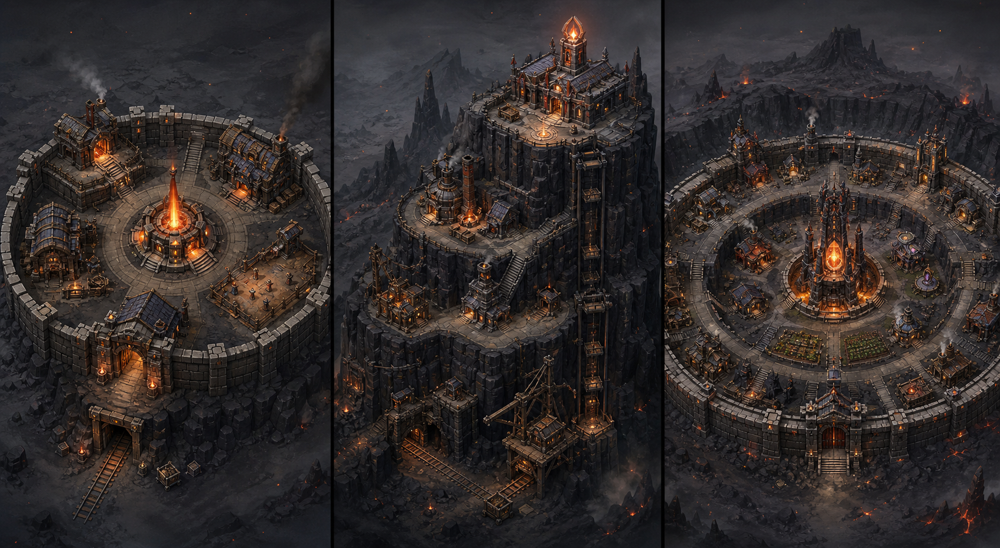

# Hold – Designrichtungen v1



Der Bogen ist eine visuelle Exploration, kein fertiges Spiel-Asset. Alle drei
Varianten zeigen dieselben Kernfunktionen in einer gemeinsamen isometrischen
Kamera und Ember-Farbwelt.

## A – Ember-Bastion (links)

Kompakter Ringwall um den zentralen Ember-Kern. Mine, Schmiede, Lager und
Übungshof liegen als klar getrennte Module am Rand.

- beste Lesbarkeit auf kleinen Bildschirmen
- Gebäude lassen sich günstig als austauschbare Slots produzieren
- klare Startbasis für Phase 1
- visuell etwas vertrauter und weniger eigenständig

## B – Klippenfestung (Mitte)

Vertikale Festung: Mine und Förderanlagen unten, Verarbeitung in der Mitte,
Kommandohalle und Ember-Leuchtfeuer oben.

- stärkste eigene Silhouette und glaubwürdige Produktionskette
- Fortschritt ist räumlich sofort verständlich: Ausbau wächst nach oben
- passt gut zu einer vertikal scrollenden Mobilansicht
- teuerste Variante bei Navigation, Animationen und Hintergrundgestaltung

## C – Kraterhold (rechts)

Mehrere konzentrische Ringe: Verteidigung außen, Produktion in der Mitte,
Warden- und Ember-Kern im Zentrum.

- beste langfristige Erweiterbarkeit
- Gebäudekategorien können als eigene Ringe organisiert werden
- vermittelt eine große, lebendige Siedlung
- für den ersten Vertical Slice zu umfangreich und auf Mobilgeräten schnell
  unübersichtlich

## Empfehlung

Für den kosteneffizienten Vertical Slice verwenden wir **A als Layoutbasis**.
Die Basis startet mit einem Kern und vier bis sechs festen Gebäudeslots. Aus B
übernehmen wir später die starke Mine-zu-Leuchtfeuer-Silhouette als visuelle
Identität, ohne bereits eine mehrstöckige Navigation bauen zu müssen.

Vor der Umsetzung braucht es als nächsten Entwurf einen funktionalen
Low-Fidelity-Bildschirm: Gebäudeslots, Ressourcenleiste, Bauzustände und der
Weg von Produktion zu Ausrüstung – noch ohne finale Grafik.

## Generationshinweis

Erstellt mit der integrierten Bildgenerierung und folgendem Prompt:

```text
Create three clearly different design concepts for the player's fortified
base, the Hold, as a polished three-panel concept sheet. Show a compact
circular ember bastion, a vertical cliff fortress and a concentric crater hold
in the same three-quarter isometric camera and comparable scale. Stylized
dark-fantasy game environment concept art, painterly 3D look, production-ready
readable architecture, charcoal basalt and aged iron contrasted with warm
ember-orange light. Include visually readable mine, smelter, forge, storage,
training and arcane functions. No text, UI, logos or watermark; avoid generic
castle skylines, excessive gothic spires, photorealism and clutter.
```
